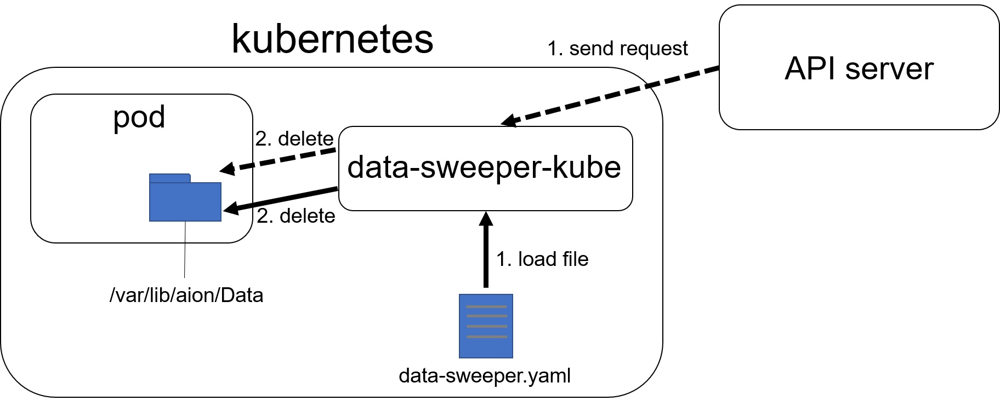

# data-sweeper-kube
data-sweeper-kubeは、kubernetes上で動作するdata-sweeperです。マイクロサービスが生成した不要なファイルを定期的に削除します。

## 概要
data-sweeper-kubeは、ファイル名や拡張子によって指定された、`/var/lib/aion/Data`配下(デフォルト設定)のファイルを、一定の期間(interval)をはさんで削除します。ターゲットファイルや、除外するファイルの指定の仕方は、`sample.yml`を参照してください。  
また、data-sweeper-kubeはAPI serverを起動します。`http://localhost:8080/sweeper` にリクエストを送信することで、ターゲットファイルを指定し、削除させることができます。

## 動作環境
data-sweeper-kubeは、aion-coreのプラットフォーム上での動作を前提としています。 使用する際は、事前に下記の通りAIONの動作環境を用意してください。   
* ARM CPU搭載のデバイス(NVIDIA Jetson シリーズ等)   
* OS: Linux Ubuntu OS   
* CPU: ARM64   
* Kubernetes   
* AION のリソース   

## 起動方法
1. docker imageのbuild
```
$ cd /path/to/data-sweeper-kube
$ make docker-build
```
2. Deploymentの作成
```
$ cd /path/to/data-sweeper-kube
$ kubectl apply -f ./k8s/data-sweeper.yaml
```

3. Deployment作成後、以下のコマンドでPodが正しく生成されていることを確認
```
$ kubectl get pods
```

## I/O
### Input
#### <yamlファイルから指定する場合>
data-sweeper.yamlファイルを作成し、削除するファイルを指定してください。
具体的なyamlファイルの記述方法は、`sample.yaml`を参照してください。  
yamlファイルの配置場所は、デフォルトでは`/var/lib/aion/default/config`になっています。

#### <API serverから指定する場合>
json形式でPOSTリクエストを送信してください。
リクエストの例は以下の通りです。
```
{
    "dir_path": "/var/lib/aion/Data",
    "exclude_files": ['202008201552.jpg', '202008111543.mp4', '202008111544.png'],
    "exclude_file_extensions": ['jpg', 'mp4', 'json']
    "is_recursive": true
}
```
### Output
`/var/lib/aion/Data`配下のファイルが削除されます。


## 各種設定の変更
k8s/data-sweeper.ymlファイルのパラメーターを変更することで、Inputを指定するyamlファイルの配置場所や、削除対象のディレクトリ、intervalを変更することができます。
### ディレクトリの変更
| volumeMounts/volumes | name   | デフォルト値                 | 備考                                   | 
| :------------------: | :----: | ---------------------------- | :------------------------------------: | 
| volumeMounts         | data   | /var/lib/aion/Data           | 削除対象のディレクトリ　(コンテナ上)     | 
| volumeMounts         | config | /var/lib/aion/config         | yamlファイルの配置場所　(コンテナ上) | 
| volumes              | data   | /var/lib/aion/default/Data   | 削除対象のディレクトリ                 | 
| volumes              | config | /var/lib/aion/default/config | yamlファイルの配置場所                 | 

### intervalの変更
| name                 | default | 
| :------------------: | :-----: | 
| SWEEP_CHECK_INTERVAL | 3000ms    | 

## システム図

