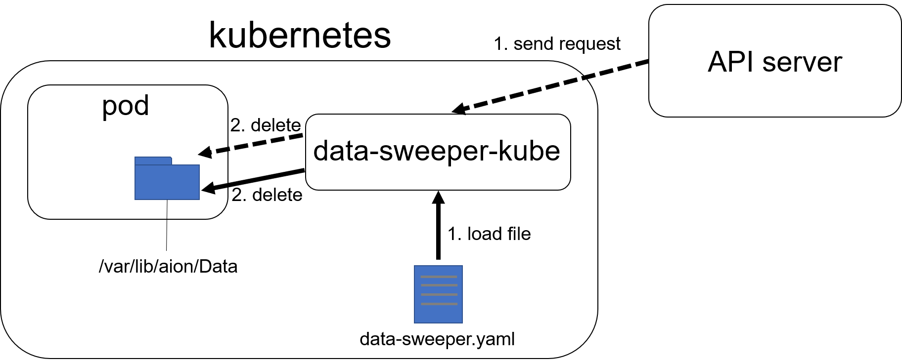

# data-sweeper-kube
data-sweeper-kubeは、kubernetes上で動作するdata-sweeperです。マイクロサービスが生成した不要なファイルを定期的に削除します。
# 概要
data-sweeper-kubeは、ファイル名や拡張子によって指定された、/var/lib/aion/Data配下(デフォルト設定)のファイルを、一定の期間(interval)をはさんで削除します。ターゲットファイルや、除外するファイルの指定の仕方は、sample.ymlを参照してください。  
また、data-sweeper-kubeはAPI serverを起動します。http://localhost:8080/sweeper にリクエストを送信することで、ターゲットファイルを指定し、削除させることができます。
# 動作環境
data-sweeper-kubeは、kubernetesおよびaion-core上での動作を前提としています。aion-coreの起動後に起動してください。
# 起動方法
上記の環境下で、以下のコマンドを入力してDeploymentを作成してください。
```
$ cd /path/to/data-sweeper-kube
$ kubectl apply -f ./k8s/data-sweeper.yaml
```
Deployment作成後、以下のコマンドでPodが正しく生成されていることを確認してください。
```
$ kubectl get pods
```
また、docker imageのbuild方法は以下の通りです。
```
$ cd /path/to/data-sweeper-kube
$ make
```
# Input/Output
## Input
### yamlファイルから指定する場合
data-sweeper.yamlファイルを作成し、削除するファイルを指定してください。
具体的なyamlファイルの記述方法は、sample.yamlを参照してください。  
yamlファイルの配置場所は、デフォルトでは/var/lib/aion/default/configになっています。
### API serverから指定する場合
json形式でPOSTリクエストを送信してください。
リクエストの例は以下の通りです。
```
{
    "dir_path": "/var/lib/aion/Data",
    "exclude_files": ['202008201552.jpg', '202008111543.mp4', '202008111544.png'],
    "exclude_file_extensions": ['jpg', 'mp4', 'json']
    "is_recursive": true
}
```
## Output
/var/lib/aion/Data配下のファイルが削除されます。
# 各種設定の変更
k8s/data-sweeper.ymlファイルのパラメーターを変更することで、Inputを指定するyamlファイルの配置場所や、削除対象のディレクトリ、intervalを変更することができます。
## ディレクトリの変更
| volumeMounts/volumes | name   | デフォルト値                 | 備考                                   | 
| :------------------: | :----: | ---------------------------- | :------------------------------------: | 
| volumeMounts         | data   | /var/lib/aion/Data           | 削除対象のディレクトリ　(コンテナ上)     | 
| volumeMounts         | config | /var/lib/aion/config         | yamlファイルの配置場所　(コンテナ上) | 
| volumes              | data   | /var/lib/aion/default/Data   | 削除対象のディレクトリ                 | 
| volumes              | config | /var/lib/aion/default/config | yamlファイルの配置場所                 | 

## intervalの変更
| name                 | default | 
| :------------------: | :-----: | 
| SWEEP_CHECK_INTERVAL | 3000ms    | 
# システム図

